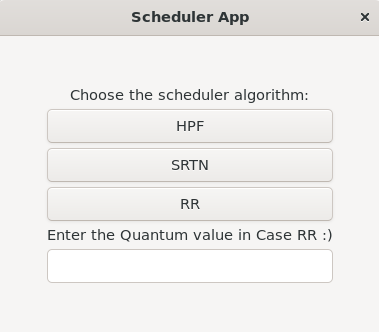

# **Scheduler App**
> A CPU scheduler determines an order for the execution of its scheduled processes. It decides which process will run according to a certain data structure that keeps track of the processes in the system and their status
### The Implemented Algothrims
> Non-preemptive Highest Priority First (HPF).
>  Shortest Remaining time Next (SRTN).
>   Round Robin (RR).
### Scheduler App Interface


### Sample Output


### To run Project
1. **Download these libraries**

   - ```bash
        sudo apt-get install libcairo2-dev  
     ```
   - ```bash
        sudo apt-get install libgtk-3-dev 
2. **Compile Project** 
    - ```bash
       make 
2. **Run Process Generator**
    - ```bash
       make run
   
